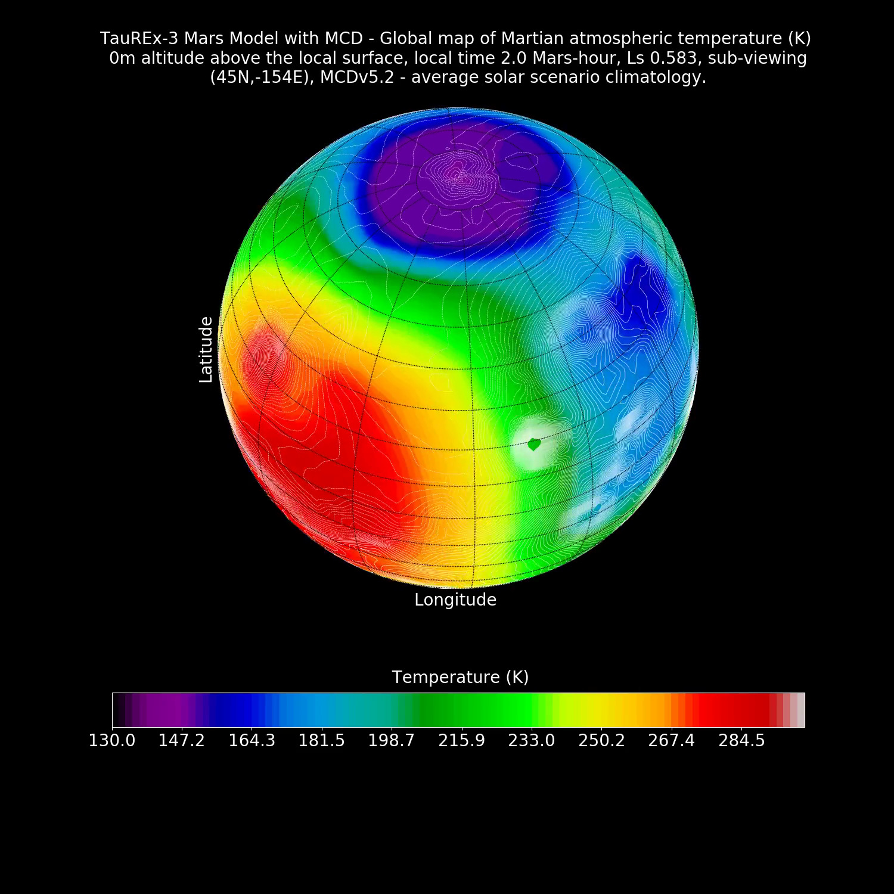

# MCD-movie (Mars Climate Database Movie) 

MCD-movie utilises the Mars Climate Database full version 5.3 to generate global visualisations of Mars and the Martian atmosphere. 

1. MCD-movie example grid.


The goal of MCD-movie is used to generate visualisations of the Martian atmosphere. MCD-movie, through the MCD, offers the possibility generating a very large synthetic database of Martian atmospheric imagery, which could be linked to MSSS MRO MARCI weather imagery, http://www.msss.com/msss_images/subject/weather_reports.html. 

2. MCD-movie example image.


The data used to create the visualisations is from the Mars Climate Database (MCD) (Version 5.2). The Mars Climate Database is a database which contains the output of a Global Climate Model. The GCM was developed predominately by the LMD with contributions from the OU, Oxford, ESA and CNES and the Instituto de Astrofisica de Andalucia and is validated using observational data. 

# MCD Documentation

The MCD User Manual and the MCD Detailed Design Document can be found on the following documentation page: http://www-mars.lmd.jussieu.fr/mars/info_web/. 

The full version includes a basic python script that allows one to just select a particular atmospheric property, at one height, at a particular longitude and latitude point, at a particular solar longitude, at a particular local time. Generating global visualisations requires modifying the basic script to loop over a latitude-longitude grid to select an atmospheric property at a particular height.

Furthermore, modifying the script to take into account that each different longitude will have a different local time and each longitude must also update its local time correctly each timestep. Furthermore, as time increases the solar longitude of Mars increases. These are not inbuilt to the basic script, but are in MCD-movie script provided. Then the latitude-longitude grid has to be mapped from cartesian coordinates into spherical coordinates. To generate movies stack all of the output images and merge with ffmpeg.

# Requirements

1. The MCD 5.3 Full version. In order to obtain a copy of the MCD v5.3 contact forget@lmd.jussieu.fr or millour@lmd.jussieu.fr.
2. ffmpeg. 
3. numpy.
4. Basemap.
5. matplotlib.

# Colab
The following notebook MCD-movie.ipynb run on Colab provides access to the MCD-movie.

# Contact
George Cann, Department of Space and Climate Physics (Mullard Space Science Laboratory), University College London.
Email: george.cann.15@ucl.ac.uk. 

# Citation
```
1. George Cann
MCD-movie, (2020)
https://github.com/ghcann/MCD-movie
```

```
@article{cann_mcd_movie
  title={MCD-movie},
  author={George Cann},
  journal={arXiv TBC},
  url={https://github.com/ghcann/MCD-movie},
  year={2020}
}
```

# Acknowledgements

The author would like to thank University College London, Open University, University of Oxford, European Space Agency and CNES and the Instituto de Astrofisica de Andalucia. 
